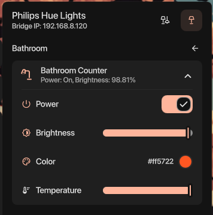

# Philips Hue Management from DMS

A bar widget that lets you manage your Philips Hue lighting from your desktop.

<p align="center">
    
</p>

**Note:** A Hue Bridge is required for [OpenHue](https://www.openhue.io/) to
manage your devices.

## Features

- **Supports both lights and rooms**: Control an entire room or individual
  lights
- **Guided setup**: Prompts for OpenHue bridge pairing if not already configured
- **Real-time updates**: Listens to your Hue Bridge's event stream for real-time
  updates, instantly reflecting any changes made via the app or automations
- **Brightness and temperature control**: Manually control a devices's
  brightness level and temperature value
- **Color control**: Leverages the builtin DMS color picker to set a devices's
  color directly
- **Device icons**: Maps your Philips Hue icons to the closest equivalent from
  Material Symbols

## Installation

**Note**: `dms-hue-manager` is not yet in the DMS plugin registry, so manual
installation is required.

### Manually

```bash
cd ~/.config/DankMaterialShell/plugins
git clone https://github.com/derethil/dms-hue-manager.git
```

1. Install the [OpenHue CLI](https://www.openhue.io/) and `jq`
1. Open DMS Settings (Ctrl+,)
1. Navigate to the Plugins tab
1. Click "Scan for plugins"
1. Enable the Hue Manager plugin

### Nix

Enable the OpenHue CLI and `jq` e.g.

```nix
home.packages = with pkgs; [
  openhue-cli
  jq
];
```

Then add this plugin to DMS:

```nix
dms-hue-manager = {
  url = "github:derethil/dms-hue-manager";
  flake = false;
};
```

```nix
programs.dankMaterialShell = {
  plugins = {
    HueManager.src = "${inputs.dms-hue-manager}"
  };
};
```

## Configuration

Plugin options can be configured in the Plugins tab in DMS Settings; they are
also stored in `~/.config/DankMaterialShell/plugin_settings.json`:

```json
{
  "hueManager": {
    "openHuePath": "openhue",
    "jqPath": "jq",
    "enabled": true,
    "useDeviceIcons": true
  }
}
```
